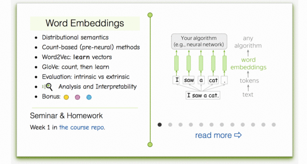
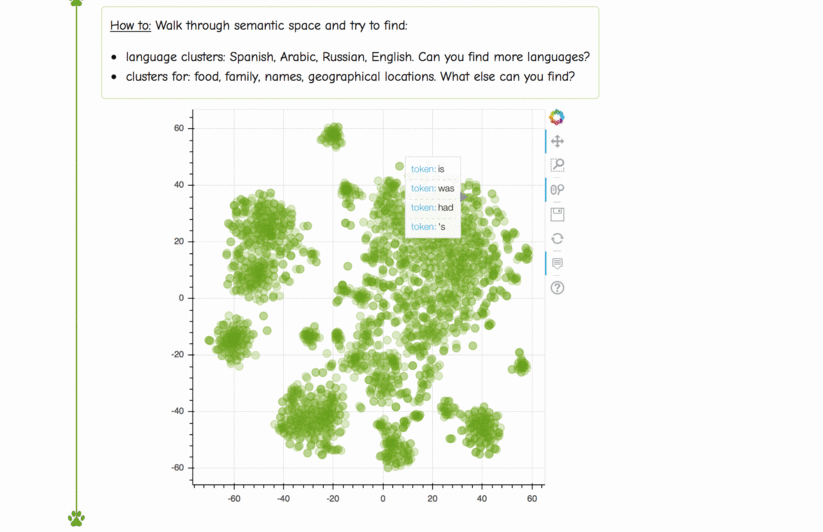

# Week 1

## Word embeddings
- [__Lecture slides__](https://drive.google.com/file/d/1YJi56rdgKANlOE_Uam4LDAKhDyjJTD1L/view?usp=sharing)
- Our videos: [__Lecture 2__](https://washington.zoom.us/rec/share/gnfnhjWW5RS9j44VCdaT8rv55wWqacYthYGwW90KcS-Wr8TKUAJahigCumwIDeIK.Em6_MJPWHBylNpen), [__Lecture 3__](https://washington.zoom.us/rec/share/IlI8_syVifHF0w_-UlSX13ljuTcVAol31IaCfksbep1cnB1Fgj_SuhT0IDXh9Rj6.AQVdHq7bcCvFCBdN)
- Lecture video from Stanford CS224N - [__Intro__](https://www.youtube.com/watch?v=OQQ-W_63UgQ), [__Embeddings__](https://www.youtube.com/watch?v=ERibwqs9p38) (english)

## Practice & homework
The practice for this week takes place in notebooks. Just open them and follow instructions from there.
* __Seminar:__ `./seminar.ipynb`
* __Homework:__ `./homework.ipynb`

Unless explicitly said otherwise, all subsequent weeks follow the same pattern (notebook with instructions).

If you have any difficulties with notebooks, just open them in .

### Lecture-blog, research thinking exercises, related papers and fun: 
####  [NLP Course For You](https://lena-voita.github.io/nlp_course.html#preview_word_emb) 

### Take a walk through space... Semantic Space!
####  [NLP Course For You](https://lena-voita.github.io/nlp_course/word_embeddings.html#analysis_interpretability) 

## More materials (optional)
* On hierarchical & sampled softmax estimation for word2vec [page](http://ruder.io/word-embeddings-softmax/)
* GloVe project [page](https://nlp.stanford.edu/projects/glove/)
* FastText project [repo](https://github.com/facebookresearch/fastText)