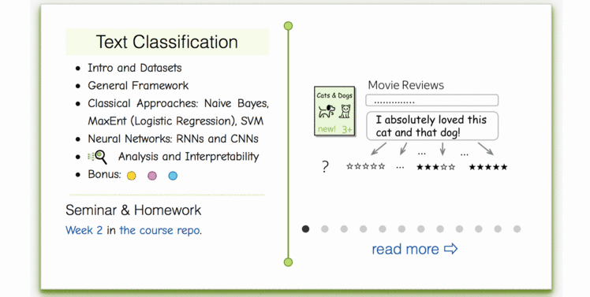
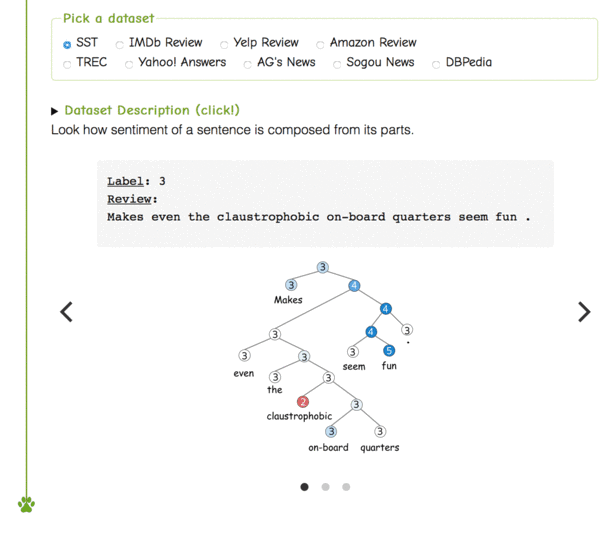

# Weeks 4-6

## Text classification
- [__Lecture slides__](https://drive.google.com/file/d/1G4UDH3BIm0kxjNjvlTUPzy8MPzWwsOgp/view?usp=sharing)
- Our videos: 
* Stanford NLP lecture: [__Text convolutions__](https://www.youtube.com/watch?v=nzSPZyjGlWI)

## Practice & homework
Seminar 

Your task for this week is to get past two notebooks: `./homework_part1.ipynb` and... you guessed it, `./homework_part2.ipynb`. 

The second part of homework requires you to train a deep neural network. See `./seminar.ipynb` for problem description, tips and tricks.

### Lecture-blog, research thinking exercises, related papers and fun: 
####  [NLP Course For You](https://lena-voita.github.io/nlp_course.html#preview_text_clf) 

### Dataset viewer:
####  [NLP Course For You](https://lena-voita.github.io/nlp_course/text_classification.html#dataset_examples) 

## More materials
* Colah's blog on convolutions, including text convolutions - [url](http://colah.github.io/posts/2014-07-Understanding-Convolutions/)
* Same architectures applied for music - [blog post](http://benanne.github.io/2014/08/05/spotify-cnns.html)