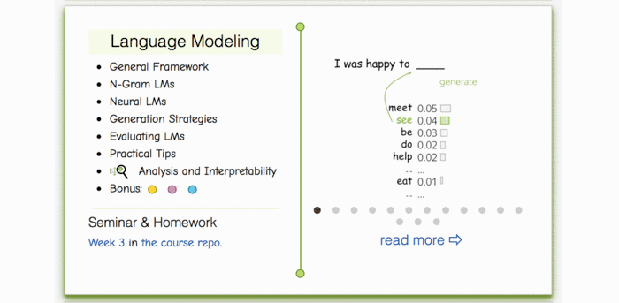
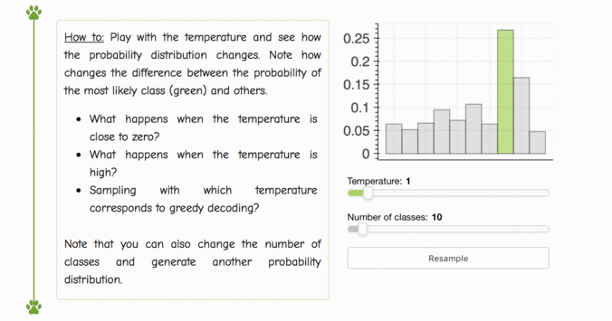

# Weeks 7-9

## Language Modeling
- [__Lecture slides__](https://drive.google.com/file/d/1t_ZfmLqlhZTYe-3a-3M9uqQfH_xJYSh-/view?usp=sharing)
* Our videos (russian):
* Stanford NLP videos: [N-gram language models](https://archive.org/details/41IntroductionToNGramsStanfordNLPProfessorDanJurafskyChrisManning/), [neural language models](https://www.youtube.com/watch?v=Keqep_PKrY8)

## Practice & homework
Seminar: 

As usual, `./seminar.ipynb` and `./homework_*.ipynb` await you :)

### Lecture-blog, research thinking exercises, related papers and fun: 
####  [NLP Course For You](https://lena-voita.github.io/nlp_course.html#preview_lang_models) 

### Play with softmax temperature:
####  [NLP Course For You](https://lena-voita.github.io/nlp_course/language_modeling.html#generation_strategies_temperature) 

## More materials
* CS231 lecture on RNNs by Andrej Karpathy, 2016)- [video](https://www.youtube.com/watch?v=iX5V1WpxxkY) (english)
* A more detailed lecture by Y. Bengio, 2016 - [video](https://www.youtube.com/watch?v=xK-bzjIQkmM)
* Great reading by A. Karpathy, 2015 - [The Unreasonable Effectiveness of Recurrent Neural Networks](http://karpathy.github.io/2015/05/21/rnn-effectiveness/)
* LSTM explained in detail by Christopher Olah (Anthropic), 2015 - [Understanding LSTM Networks](http://colah.github.io/posts/2015-08-Understanding-LSTMs/)
* ["Awesome RNNs"](https://github.com/kjw0612/awesome-rnn) A curated list of resources dedicated to recurrent neural networks, good entry point by Jiwon Kim.

