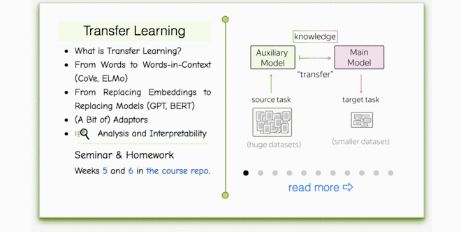

# Weeks 13-15

## Materials
* [__Lecture slides__](https://drive.google.com/file/d/10vV-lhgNrxp8QGXJIh7b8KNHuCb2t5ID/view?usp=sharing)
* Our videos (russian): [__Lecture 1__](https://washington.zoom.us/rec/share/4oiv86Y7jnhpQWUNL9qSAu7Apj3oNTW-4VGsVgS9AjTT1_pSzbbOuCh7bFMDKPZB.3o_Bp5pLzPQ7YD0V), [__Lecture 2__](https://washington.zoom.us/rec/share/ReRKeL48d2spB1wQ_modiGwHYV5fJR-JtbQLyjvK4wvt_at10PbrN-Q8PmIyS8xa.EZcSNK_x9miNxCHg)
* Huggingface [quick tour tutorial](https://huggingface.co/docs/transformers/quicktour) (recommended)
* A related [video](https://www.youtube.com/watch?v=_eSGWNqKeeY) tutorial for document classification (english)

## Practice
* Seminar - 
* Homework: `./homework.ipynb`

### Lecture-blog, research thinking exercises, related papers and fun: 
####  [NLP Course For You](https://lena-voita.github.io/nlp_course.html#preview_transfer) 

